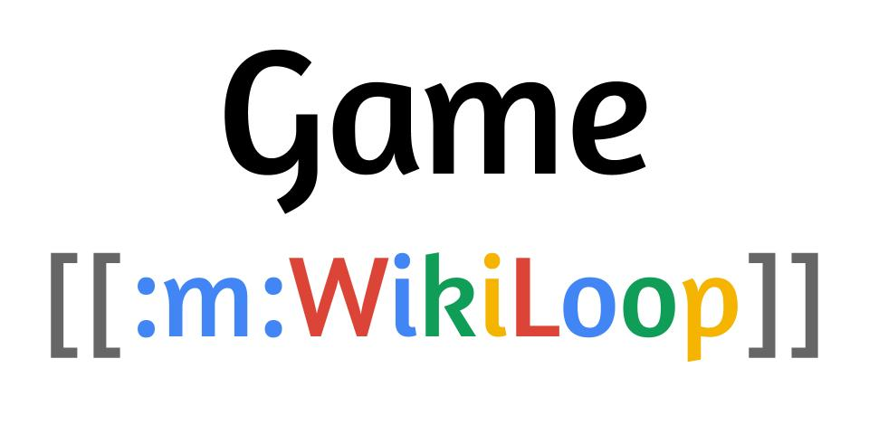

# WikiLoop Wikidata Game: Make contributing to Wikidata.org easy!

[](https://meta.wikimedia.org/wiki/WikiProject_WikiLoop)

This project is a set of games that runs on [Distributed Wikidata Game Platform](https://tools.wmflabs.org/wikidata-game/distributed/).


## Game Links
* [Missing date of birth](https://tools.wmflabs.org/wikidata-game/distributed/#game=50)
* [Missing date of death](https://tools.wmflabs.org/wikidata-game/distributed/#game=53)
* [Missing place of birth](https://tools.wmflabs.org/wikidata-game/distributed/#game=54)
* [Conflict date of birth](https://tools.wmflabs.org/wikidata-game/distributed/#game=46)
  * Source code pending release


## Local Set Up
Prerequisite: [git](https://git-scm.com), [nodejs](https://nodejs.org), [npm](https://npmjs.com)  
```bash
git clone git@github.com:google/wikiloop-wikidata-game.git
cd wikiloop-wikidata-game
```
Enter one game directory and insall dependeces. For example, missing date of birth.
```
cd  wikiloop_game_missing_date_of_birth
npm install
```
You should connect to your local mysql instance, setting configuration in this block of code.
```
  const config = {
    user: process.env.SQL_USER,
    password: process.env.SQL_PASSWORD,
    database: db
  };
```
Another choice is create a `.env` file containing environment variables by [`dotenv`](https://www.npmjs.com/package/dotenv), and store the mysql configurations there.

## Development
Please refer to [wikidata-game API](https://bitbucket.org/magnusmanske/wikidata-game/src/6a263029d3b4/public_html/distributed/?at=master) for official development document. 

## Run

Prerequisite: [KoaJS](https://koajs.com/)
```
npm start
```
